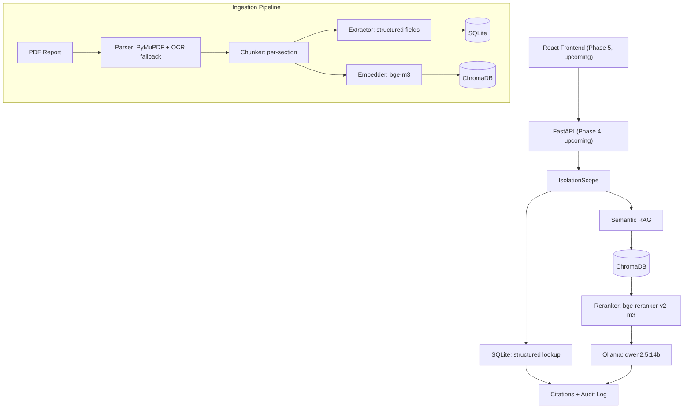

<div align="center">

<!-- docs/logo.svg placeholder: add a logo asset at this path to have it appear here -->

# EvalAssist

*AI-assisted retrieval for personnel evaluation reports. Fully offline, isolation-first, human-in-the-loop.*


</div>

## About

EvalAssist helps evaluators inside the Hellenic Armed Forces find and verify evidence buried in long, densely written personnel evaluation reports, written in Greek, without ever sending sensitive personnel data outside the perimeter. It runs entirely offline and on-prem: the embedding model, the reranker and the language model all execute on local hardware, never a cloud API. Every retrieval, whether a deterministic lookup or a semantic RAG query, is scoped server-side in code before it reaches storage, so isolation between individuals is a structural guarantee rather than a prompt instruction. Every answer carries citations back to the exact document, page and section it came from, and every query is written to an append-only audit log. The system surfaces evidence for a human evaluator to review; it never decides anything on its own.

## Features

| | Feature | Description |
|---|---|---|
| 🔍 | Structured Lookup | Deterministic SQL queries over scores and evaluation periods, no LLM involved, always reproducible |
| 🧠 | Semantic RAG with reranking | Embeds the question, retrieves candidates from ChromaDB, reranks with a cross-encoder, and grounds the LLM answer in only the top results |
| 🔒 | Isolation | Every query is scoped with a `where` filter applied server-side, in code, before it ever reaches SQLite or ChromaDB |
| 📎 | Citations | Every semantic answer points back to the exact `doc_id`, page and section it was drawn from |
| 🧾 | Audit Log | Every query, structured or semantic, is written to an append-only audit trail together with the retrieved document IDs |
| 🗂️ | Prompt Versioning | Prompts live as versioned files on disk and are resolved deterministically, so any answer can be traced to the exact prompt version used |
| 🇬🇷 | Greek OCR fallback | Scanned pages without a usable text layer fall back to Tesseract OCR with the Greek language pack |
| 🔌 | Fully Offline | No cloud APIs, no external model calls, everything runs on local hardware behind the perimeter |

## Example

**Structured lookup**

> Ερώτημα: *Ποια ήταν η βαθμολογία του Παπαδόπουλου Γιώργου στη Στοχοθεσία για το 2025;*
>
> Απάντηση: Γνωμάτευση Α. Στοχοθεσία: 4/5. Σχόλιο: "Ο εργαζόμενος πέτυχε τους στόχους του με συνέπεια." *(πηγή: doc a1b2c3d4e5f6, σελ. 1)*

**Semantic RAG**

> Ερώτημα: *Πώς αξιολογήθηκε η ηγετική ικανότητα του αξιολογούμενου το 2025;*
>
> Απάντηση: Σύμφωνα με την έκθεση, ο αξιολογούμενος επέδειξε συνεπή ηγετική ικανότητα κατά τη διάρκεια της περιόδου, με ιδιαίτερη αναφορά στη διαχείριση της ομάδας υπό πίεση. *(πηγές: doc a1b2c3d4e5f6, σελ. 2, ενότητα "Ηγετική Ικανότητα")*

*(fictional data, for illustration only)*

## Architecture



## Tech Stack

| Technology | Role |
|---|---|
|  | Backend language |
|  | HTTP API layer (upcoming) |
|  | Schema validation, `pydantic-settings` for centralized config |
|  | persons, evaluations, scores, documents, audit_log |
|  | Vector store for semantic chunks |
|  | Local dense embedding model |
|  | Local cross-encoder reranker |
|  | Local LLM for grounded answer generation |
|  | PDF parsing |
|  | OCR fallback for scanned pages |
|  | Frontend (Phase 5, upcoming) |
|  | Frontend language (Phase 5, upcoming) |
|  | Frontend styling (Phase 5, upcoming) |

Every model in this table runs locally. No layer of the system calls a cloud API.

## Quick Start

```bash
git clone <repository-url>
cd evalassist

# 1. Backend virtual environment (Python 3.12)
python3.12 -m venv backend/.venv
source backend/.venv/bin/activate

# 2. Install dependencies
pip install -r backend/requirements.txt

# 3. Configure (defaults work out of the box, override only if needed)
cp backend/.env.example backend/.env

# 4. Install Tesseract OCR with the Greek language pack
brew install tesseract tesseract-lang

# 5. Pull the local LLM
ollama pull qwen2.5:14b

# 6. Initialize the SQLite schema
cd backend
python -m app.db.database

# 7. Ingest a report
python -c "
from pathlib import Path
from app.ingestion.pipeline import run_ingestion
result = run_ingestion(Path('path/to/report.pdf'))
print(result.doc_id, result.person_id, result.period)
"

# 8. Run the standalone test suite (no real ML models or Ollama required, fakes throughout)
python tests/test_config.py
python tests/test_prompt_loader.py
python tests/test_audit.py
python tests/test_isolation.py
python tests/test_structured.py
python tests/test_semantic.py
python tests/test_chunker.py
python tests/test_ingestion_pipeline.py
```

### Frontend (Phase 5, upcoming)

The frontend has not been scaffolded yet. This section will cover setup once Phase 5 lands.

## Environment Variables

All keys below live in `backend/.env.example`. Copy it to `backend/.env` and override only what you need; every value already matches the working default.

| Variable | Description | Required | Default |
|---|---|---|---|
| `DB_PATH` | Path to the SQLite database file | No | `backend/data/evalassist.db` |
| `CHROMA_PATH` | ChromaDB persistence directory | No | `backend/chroma_db` |
| `CHROMA_COLLECTION` | ChromaDB collection name | No | `evaluation_chunks` |
| `EMBEDDING_MODEL` | HuggingFace model id used for embeddings | No | `BAAI/bge-m3` |
| `RERANKER_MODEL` | HuggingFace model id used for the cross-encoder reranker | No | `BAAI/bge-reranker-v2-m3` |
| `OLLAMA_URL` | Base URL of the local Ollama server | No | `http://localhost:11434` |
| `OLLAMA_MODEL` | Ollama model tag used for generation | No | `qwen2.5:14b` |
| `TOP_K_RETRIEVE` | Chunks retrieved from ChromaDB before reranking | No | `20` |
| `TOP_K_RERANK` | Chunks kept after reranking, passed to the LLM | No | `5` |
| `ALLOWED_ORIGINS` | CORS origins allowed by the API (Phase 4) | No | `["http://localhost:5173"]` |

## Project Structure

```
evalassist/
  backend/
    app/
      core/
        config.py           centralized settings (pydantic-settings)
        audit.py             AuditEntry, write_audit
        prompt_loader.py     versioned prompt loading (prompts/<name>/vN.txt)
        exceptions.py        domain exceptions (HTTP mapping in Phase 4)
      prompts/
        semantic_rag/
          v1.txt              semantic RAG system prompt
      db/
        database.py           SQLite connection, init_db, schema migration
        repository.py          idempotent persistence
        schema.sql              persons, evaluations, scores, documents, audit_log
      ingestion/
        parser.py               PDF parsing (PyMuPDF)
        ocr.py                   OCR fallback for scanned pages
        chunker.py               per-section chunking, config-driven
        extractor.py             structured extraction into EvaluationReport
        embedder.py              lazy-loaded BAAI/bge-m3 wrapper
        vectorstore.py            ChromaDB collection helpers
        pipeline.py               end-to-end idempotent ingestion
      retrieval/
        isolation.py              IsolationScope, server-side query scoping
        models.py                  RetrievalMode, Citation, result types
        structured.py               deterministic SQL lookups, no LLM
        reranker.py                  lazy-loaded BAAI/bge-reranker-v2-m3 wrapper
        llm.py                        Ollama chat client wrapper
        semantic.py                    RAG pipeline (embed, retrieve, rerank, generate)
      models/
        evaluation.py                EvaluationReport, KNOWN_SECTIONS (provisional template)
    tests/                          standalone tests, no real ML models or Ollama required
    .env.example
    requirements.txt
  frontend/                        React 19 + TypeScript + Vite + Tailwind v4 (Phase 5)
```

## Why EvalAssist?

| Decision | Rationale |
|---|---|
| Isolation enforced in code, not prompts | A prompt can be ignored or bypassed; a `where` filter applied before the query reaches SQLite or ChromaDB cannot |
| Single source of truth schema | `schema.sql` is the only place table structure is defined; changes are explicit and additive (see `_migrate_audit_log`) |
| LLM outputs are advisory, always cited | Every semantic answer is grounded in retrieved chunks and points back to `doc_id`/page/section; the human evaluator decides |
| File-based prompt versioning | Prompts live as files under `prompts/<name>/vN.txt`, resolved deterministically, so every answer can be traced to the exact prompt version used |
| Local-only models | Embedding, reranking and generation all run on local hardware; no request ever leaves the perimeter |
| `FakeEmbedder` test pattern | Tests substitute lightweight fakes for real ML models, so the suite runs in seconds without downloading multi-gigabyte weights |

## Roadmap

| Phase | Scope | Status |
|---|---|---|
| 1 | SQLite schema, Pydantic extraction models | Complete |
| 2 | Ingestion pipeline: parser, OCR, chunker, extractor, embedder, vectorstore | Complete (4 tests) |
| 3 | Retrieval layer: isolation, structured SQL lookups, semantic RAG, citations | Complete (11 tests) |
| Refactor | Core module (config, audit, prompt versioning, exceptions), README upgrade | Complete (8 tests) |
| 4 | FastAPI service layer, audit log persistence, HTTP error mapping | Upcoming |
| 5 | React frontend | Upcoming |
| Future | `document_qa` mode, explicit objectives/duties fields, golden set evals | Planned |

## License

Proprietary. Internal system for the Hellenic Armed Forces, not licensed for external use or redistribution.

<div align="center">

---

Built by Georgios Panagopoulos

[](https://github.com/GiorgosPanagopoulos)
[](https://www.linkedin.com)

*I build things I'd trust with something that matters.*

</div>
